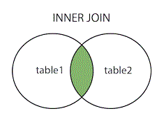
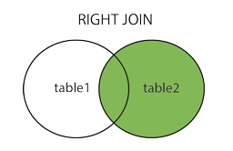
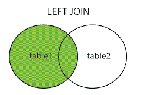
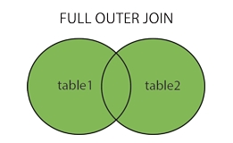

<!-- 
20240722222227
Status: #Docs 
Tags: [[PROPTIT-Basic-Database]] 
  -->
# SQL cơ bản

<!-- 
## Tổng quan buổi học.
- Bài tập về nhà buổi 2.
	- Thiết kế lại cơ sở dữ liệu cho thư viện: **User**, **Book**, **Author**, **Category**. Sử dụng các quan hệ cho cơ sở dữ liệu. (Yêu cầu: Vẽ mô hình E-R ⇒ Vẽ mô hình quan hệ dữ liệu ⇒ Thiết kế dtb trên hệ quản trị csdl)
	- Anh mong các em có thể thiết kế cơ sở dữ liệu phức tạp hơn để có thể thảo luận với nhau về nhiều chủ đề hơn.
	- Nộp bài tập vào link bên dưới gồm : hình ảnh mô hình E-R, hình ảnh mô hình quan hệ dữ liệu.
- Nội dung cần chuẩn bị
	- Query cơ bản(SELECT, JOIN, ORDER BY, GROUP BY,...)
	- SubQuery
	- Fake 1000 data trong csdl vừa tạo-
- Nội dung buổi học
	- Chữa BTVN buổi 2
	- Thảo luận về nội dung đã chuẩn bị.  -->

---
## Nội dung
### Query cơ bản.
1. **Các toán tử.**
	- Toán tử số học.
		Ví dụ với a = 10 và b = 20.
	
		| Toán tử|  Mô tả | Ví dụ   |
		|---|---|---|
		|+ (cộng)|Thêm các giá trị ở hai bên của toán tử.|a + b sẽ cho 30|
		|- (trừ)|Lấy toán hạng bên phải trừ toán hạng bên trái.|a - b sẽ cho -10|
		|* (nhân)|Nhân giá trị ở hai bên của toán tử.|A * b sẽ cho 200|
		|/ (chia)|Chia lấy phần nguyên.|b / a sẽ cho 2|
		|% (Modulus)|Chia lấy phần dư.|b % a sẽ cho 0|
		|=|Kiểm tra nếu các giá trị của hai toán hạng bằng nhau hay không, nếu có thì điều kiện trở thành true.|(a = b) là false.|
		|!=|Kiểm tra nếu các giá trị của hai toán hạng bằng hoặc không, nếu các giá trị không bằng nhau thì điều kiện trở thành true.|(a != b) là true.|
		|<>|Kiểm tra nếu các giá trị của hai toán hạng bằng hoặc không, nếu các giá trị không bằng nhau thì điều kiện trở thành true.|(a <> b) là true.|
		|>|Kiểm tra nếu giá trị của toán hạng trái lớn hơn giá trị của toán hạng phải, nếu có thì điều kiện trở thành true.|(a > b) là là false.|
		|<|Kiểm tra nếu giá trị của toán hạng trái nhỏ hơn giá trị của toán hạng phải, nếu có thì điều kiện trở thành true.|(a < b) là true.|
		|>=|Kiểm tra nếu giá trị của toán hạng trái lớn hơn hoặc bằng giá trị của toán hạng phải, nếu có thì điều kiện trở thành true.|(a >= b) là là false.|
		|<=|Kiểm tra nếu giá trị của toán hạng trái nhỏ hơn hoặc bằng giá trị của toán hạng phải, nếu có thì điều kiện trở thành true.|(a <= b) là true.|
		|!<|Kiểm tra nếu giá trị của toán hạng trái không nhỏ hơn giá trị của toán hạng phải, nếu có thì điều kiện trở thành true.|(a !< b) là sai.|
		|!>|Kiểm tra nếu giá trị của toán hạng trái không lớn hơn giá trị của toán hạng phải, nếu có thì điều kiện trở thành true.|(a! b) là true.|
	- Toán tử Logic.

		|Toán tử|Mô tả|
		|---|---|
		|ALL|Toán tử ALL được sử dụng để so sánh một giá trị với tất cả các giá trị trong một tập hợp giá trị khác.|
		|AND|Toán tử AND cho phép tồn tại nhiều điều kiện trong mệnh đề WHERE của câu lệnh SQL.|
		|ANY|Toán tử ANY được sử dụng để so sánh một giá trị với bất kỳ giá trị thích hợp nào trong danh sách theo điều kiện.|
		|BETWEEN|Toán tử BETWEEN được sử dụng để tìm kiếm các giá trị trong một tập các giá trị, với giá trị nhỏ nhất và giá trị lớn nhất.|
		|EXISTS|Toán tử EXISTS được sử dụng để tìm kiếm sự tồn tại của một hàng trong một bảng được chỉ định đáp ứng một tiêu chí nhất định.|
		|IN|Toán tử IN được sử dụng để so sánh một giá trị với một danh sách các giá trị văn bản đã được chỉ định.|
		|LIKE|Toán tử LIKE được sử dụng để so sánh một giá trị với các giá trị tương tự sử dụng toán tử ký tự đại diện.|
		|NOT|Toán tử NOT đảo ngược ý nghĩa của toán tử logic mà nó được sử dụng. Ví dụ: NOT EXISTS, NOT BETWEEN, NOT IN, vv Đây là một toán tử phủ định.|
		|OR|Toán tử OR được sử dụng để kết hợp nhiều điều kiện trong mệnh đề WHERE của câu lệnh SQL.|
		|IS NULL|Toán tử NULL được sử dụng để so sánh một giá trị với một giá trị NULL.|
		|UNIQUE|Toán tử UNIQUE tìm kiếm tất cả các hàng của một bảng quy định cho tính duy nhất (không có bản sao).|
		
1. **Các câu lệnh và mệnh đề.**
	- **Câu lệnh `INSERT INTO`**
		- Được sử dụng để thêm record mới vào một bảng đã có trong database.
		- Cú pháp:
		```Sql
		INSERT INTO TABLE_NAME (column_1, column_2, ... columnN)
		VALUES (value1, value2,... valueN)
		```
	-  **Câu lệnh `SELECT`.**
		- Lấy dữ liệu từ một TABLE và trả về dữ liệu dưới dạng một TABLE.
		- Cú pháp:
		```Sql
		SELECT column1, column2, FROM table_name
		```
		- Ngoài ra nếu muốn lấy tất cả các trường có thể sử dụng.
		``` Sql
		SELECT * FROM table_name
		```
	- **Mệnh đề `WHERE`.**
		- được sử dụng để chỉ định điều kiện khi lấy dữ liệu từ bảng hoặc bằng cách join với nhiều bảng. Nếu điều kiện thỏa mãn thì nó trả về một giá trị cụ thể từ bảng.
		- Cú pháp:
		```Sql
		SELECT column1, column2, columnN
		FROM table_name
		WHERE [condition]
		```
		- Ví dụ: 
			- Bảng CUSTOMERS.
			
				| ID  | NAME     | AGE | ADDRESS | SALARY   |
				|:--- |:-------- |:--- |:------- |:-------- |
				| 1   | Ha Anh   | 32  | Da Nang | 2000.00  |
				| 2   | Van Ha   | 25  | Ha Noi  | 1500.00  |
				| 3   | Vu Bang  | 23  | Vinh    | 2000.00  |
				| 4   | Thu Minh | 25  | Ha Noi  | 6500.00  |
				| 5   | Hai An   | 27  | Ha Noi  | 8500.00  |
				| 6   | Hoang    | 22  | Ha Noi  | 4500.00  |
				| 7   | Binh     | 24  | Ha Noi  | 10000.00 |
			- Cú pháp:
			 ``` Sql
			 SELECT ID, NAME, SALARY
			 FROM CUSTOMERS
			 WHERE SALARY > 2000
			```
			- Bảng kết quả
	
				| ID  | NAME     | SALARY |
				| --- | -------- | ------ |
				| 4   | Thu Minh | 6500.00  |
				| 5   | Hai An   | 8500.00  |
				| 6   | Hoang    | 4500.00  |
				| 7   | Binh     | 10000.00 |
	- **Toán tử `AND`, `OR` và `NOT`.**
		- Toán tử AND, OR được sử dụng để kết hợp nhiều điều kiện nhằm thu hẹp dữ liệu trong câu lệnh SQL. Toán tử NOT được sử dụng để phủ định các điều kiện.
		- Toán tử AND , OR.
			- Cú pháp:
			``` Sql
			SELECT column1, column2, columnN
			FROM table_name
			WHERE [condition1] AND [condition2]
			```
			- Ví dụ:
				- Bảng CUSTOMERS.
				
					| ID  | NAME     | AGE | ADDRESS | SALARY   |
					|:--- |:-------- |:--- |:------- |:-------- |
					| 1   | Ha Anh   | 32  | Da Nang | 2000.00  |
					| 2   | Van Ha   | 25  | Ha Noi  | 1500.00  |
					| 3   | Vu Bang  | 23  | Vinh    | 2000.00  |
					| 4   | Thu Minh | 25  | Ha Noi  | 6500.00  |
					| 5   | Hai An   | 27  | Ha Noi  | 8500.00  |
					| 6   | Hoang    | 22  | Ha Noi  | 4500.00  |
					| 7   | Binh     | 24  | Ha Noi  | 10000.00 |
				- Code:
				``` Sql
				SELECT ID, NAME, SALARY
				FROM CUSTOMERS
				WHERE SALARY > 2000 AND TUOI < 27
				```
				- Bảng kết quả:
	
					|ID|NAME|SALARY|
					|:---|:---|:---|
					|4|Thu Minh|6500.00|
					|6|Hoang|4500.00|
					|7|Binh|10000.00|
		- Toán tử NOT.
			- Cú pháp:
			```Sql
			SELECT column1, column2, columnN
			FROM table_name
			WHERE NOT [condition]
			```
			- Ví dụ:
				- Code.
				``` Sql
				SELECT ID, NAME, SALARY
				FROM CUSTOMERS 
				WHERE NOT SALARY > 2000
				```
				- Bảng kết quả:
	
					|ID|NAME|SALARY|
					|:---|:---|:---|
					| 1   | Ha Anh   | 2000.00  |
					| 2   | Van Ha   | 1500.00  |
					| 3   | Vu Bang  |2000.00  |
	- **Câu lệnh `UPDATE`.**
		- Sử dụng để thay đổi các bản ghi hiện có trong 1 bảng.
		- Cú pháp:
		``` Sql
		UPDATE table_name
		SET column1 = value1, column2 = value2, columnN = valueN
		WHERE [condition]
		```
		- Ví dụ:
			- Bảng CUSTOMERS.
		
				| ID  | NAME     | AGE | ADDRESS | SALARY   |
				|:--- |:-------- |:--- |:------- |:-------- |
				| 1   | Ha Anh   | 32  | Da Nang | 2000.00  |
				| 2   | Van Ha   | 25  | Ha Noi  | 1500.00  |
				| 3   | Vu Bang  | 23  | Vinh    | 2000.00  |
				| 4   | Thu Minh | 25  | Ha Noi  | 6500.00  |
				| 5   | Hai An   | 27  | Ha Noi  | 8500.00  |
				| 6   | Hoang    | 22  | Ha Noi  | 4500.00  |
				| 7   | Binh     | 24  | Ha Noi  | 10000.00 |
			- Cú pháp:
			``` Sql
			UPDATE CUSTOMERS
			SET ADDRESS = 'HA NOI'
			WHERE ID = 3
			```
			- Bảng kết quả:
			
				| ID  | NAME     | AGE | ADDRESS | SALARY   |
				|:--- |:-------- |:--- |:------- |:-------- |
				| 1   | Ha Anh   | 32  | Da Nang | 2000.00  |
				| 2   | Van Ha   | 25  | Ha Noi  | 1500.00  |
				| 3   | Vu Bang  | 23  | Ha Noi    | 2000.00  |
				| 4   | Thu Minh | 25  | Ha Noi  | 6500.00  |
				| 5   | Hai An   | 27  | Ha Noi  | 8500.00  |
				| 6   | Hoang    | 22  | Ha Noi  | 4500.00  |
				| 7   | Binh     | 24  | Ha Noi  | 10000.00 |
		
	- **Câu lệnh DELETE**
		- Sử dụng để xóa các bản ghi hiện có trong một bảng.
		- Cú pháp:
			``` Sql
			DELETE FROM table_name
			WHERE [condition]
			```
		- Ví dụ:
			- Bảng CUSTOMERS.
	
				| ID  | NAME     | AGE | ADDRESS | SALARY   |
				|:--- |:-------- |:--- |:------- |:-------- |
				| 1   | Ha Anh   | 32  | Da Nang | 2000.00  |
				| 2   | Van Ha   | 25  | Ha Noi  | 1500.00  |
				| 3   | Vu Bang  | 23  | Vinh    | 2000.00  |
				| 4   | Thu Minh | 25  | Ha Noi  | 6500.00  |
				| 5   | Hai An   | 27  | Ha Noi  | 8500.00  |
				| 6   | Hoang    | 22  | Ha Noi  | 4500.00  |
				| 7   | Binh     | 24  | Ha Noi  | 10000.00 |
			- Cú pháp:
			``` Sql
			DELETE FROM CUSTOMERS 
			WHERE ID = 5
			```
			- Bảng kết quả:
	
				| ID  | NAME     | AGE | ADDRESS | SALARY   |
				|:--- |:-------- |:--- |:------- |:-------- |
				| 1   | Ha Anh   | 32  | Da Nang | 2000.00  |
				| 2   | Van Ha   | 25  | Ha Noi  | 1500.00  |
				| 3   | Vu Bang  | 23  | Vinh    | 2000.00  |
				| 4   | Thu Minh | 25  | Ha Noi  | 6500.00  |
				| 6   | Hoang    | 22  | Ha Noi  | 4500.00  |
				| 7   | Binh     | 24  | Ha Noi  | 10000.00 |
	- Mệnh đề `LIKE`.
		- Được sử dụng để so sánh với một giá trị tương tự sử dụng toán tử ký tự đại diện (%, _).
		- Cú pháp:
		``` Sql
		SELECT FROM table_name
		WHERE COLUMN LIKE '%XXXX%' or SELECT FROM table_name
		WHERE column LIKE '%XXXX%'or SELECT FROM table_name
		WHERE column LIKE 'XXXX_' or SELECT FROM table_name
		WHERE column LIKE '_XXXX' or SELECT FROM table_name
		WHERE column LIKE '_XXXX_'
		```
	- **Mệnh đề `TOP`.**
		- Được sử dụng để lấy ra N bản ghi hoặc X% số lượng bản ghi từ bảng.
		- Cú pháp:
		``` Sql
		SELECT TOP number|percent column1, column2, columnN
		FROM table_name
		WHERE [condition]
		```
		- Ví dụ:
			- Bảng CUSTOMERS
	
				| ID  | NAME     | AGE | ADDRESS | SALARY   |
				|:--- |:-------- |:--- |:------- |:-------- |
				| 1   | Ha Anh   | 32  | Da Nang | 2000.00  |
				| 2   | Van Ha   | 25  | Ha Noi  | 1500.00  |
				| 3   | Vu Bang  | 23  | Vinh    | 2000.00  |
				| 4   | Thu Minh | 25  | Ha Noi  | 6500.00  |
				| 5   | Hai An   | 27  | Ha Noi  | 8500.00  |
				| 6   | Hoang    | 22  | Ha Noi  | 4500.00  |
				| 7   | Binh     | 24  | Ha Noi  | 10000.00 |
			- Code: 
			``` Sql
			SELECT TOP 3 * FROM CUSTOMERS
			```
			- Bảng kết quả:
			
				| ID  | NAME     | AGE | ADDRESS | SALARY   |
				|:--- |:-------- |:--- |:------- |:-------- |
				| 1   | Ha Anh   | 32  | Da Nang | 2000.00  |
				| 2   | Van Ha   | 25  | Ha Noi  | 1500.00  |
				| 3   | Vu Bang  | 23  | Vinh    | 2000.00  |
	- **Mệnh đề `ORDER BY`.**
		- Sử dụng để sắp xếp dữ liệu theo thứ tự tăng dần hoặc giảm dần.
		- Lệnh `ASC` để sắp xếp theo thứ tự tăng dần, `DSC` để sắp xếp theo thứ tự giảm dần.
		- Cú pháp:
		```Sql
		SELECT column1, column2, columnN
		FROM table_name
		WHERE [condition]
		ORDER BY column1, column2, columnN [ASC|DSC] 
		```
		- Ví dụ:
			- Bảng CUSTOMERS
	
				| ID  | NAME     | AGE | ADDRESS | SALARY   |
				|:--- |:-------- |:--- |:------- |:-------- |
				| 1   | Ha Anh   | 32  | Da Nang | 2000.00  |
				| 2   | Van Ha   | 25  | Ha Noi  | 1500.00  |
				| 3   | Vu Bang  | 23  | Vinh    | 2000.00  |
				| 4   | Thu Minh | 25  | Ha Noi  | 6500.00  |
				| 5   | Hai An   | 27  | Ha Noi  | 8500.00  |
				| 6   | Hoang    | 22  | Ha Noi  | 4500.00  |
				| 7   | Binh     | 24  | Ha Noi  | 10000.00 |
			- Code:
			```Sql
			SELECT * FROM CUSTOMERS
				ORDER BY ID DESC
			```
			- Bảng kết quả.
	
				| ID  | NAME     | AGE | ADDRESS | SALARY   |
				|:--- |:-------- |:--- |:------- |:-------- |
				| 7   | Binh     | 24  | Ha Noi  | 10000.00
				| 6   | Hoang    | 22  | Ha Noi  | 4500.00  |
				| 5   | Hai An   | 27  | Ha Noi  | 8500.00  |
				| 4   | Thu Minh | 25  | Ha Noi  | 6500.00  |
				| 3   | Vu Bang  | 23  | Vinh    | 2000.00  |
				| 2   | Van Ha   | 25  | Ha Noi  | 1500.00  |
				| 1   | Ha Anh   | 32  | Da Nang | 2000.00  |
	- **Mệnh đề `GROUP BY`.**
		- Được sử dụng hợp tác với câu lệnh SELECT để sắp xếp dữ liệu thành các nhóm.
		- Mệnh để GROUP BY tuân theo mệnh đề WHERE trong câu lệnh SELECT và đứng trước mệnh để ORDER BY.
		- Cú pháp:
		``` Sql
		SELECT column1, column2
		FROM table_name
		WHERE [conditions]
		GROUP BY column1, column2
		ORDER BY column1, column2
		```
		- Ví dụ:
			- Bảng CUSTOMERS
	
				| ID  | NAME     | AGE | ADDRESS | SALARY   |
				|:--- |:-------- |:--- |:------- |:-------- |
				|  1 | Ha Anh   |  32 | Ha Noi    |  2000.00 |
				|  2 | Ha Anh   |  25 | Ha Noi    |  1500.00 |
				|  3 | Vu Bang  |  23 | Vinh      |  2000.00 |
				|  4 | Thu Minh |  25 | Ha Noi    |  6500.00 |
				|  5 | Hai An   |  27 | Ha Noi    |  8500.00 |
				|  6 | Hai An   |  22 | Ha Noi    |  4500.00 |
				|  7 | Hai An   |  24 | Ha Noi    | 10000.00 |
			- Code:
			``` Sql
			SELECT NAME, SUM(SALARY) FROM CUSTOMERS
				GROUP BY NAME
			```
			- Bảng kết quả
			
				|NAME|SUM(SALARY)|
				|---|---|
				| Ha Anh   |     3500.00 |
				| Hai An   |    23000.00 |
				| Thu Minh |     4500.00 |
				| Vu Bang  |     2000.00 |
	- **Từ khóa `Distinct`**
		- Được sử dụng kết hợp với câu lệnh SELECT để loại bỏ tất cả các bản ghi trùng lặp và chỉ lấy các bản ghi duy nhất.
		- Cú pháp:
		```Sql
		SELECT DISTINCT column1, column2, columnN
		FROM table_name
		WHERE [condition] 
		```
		- Ví dụ:
			- Bảng CUSTOMERS:
			
				|ID|NAME|AGE|ADDRESS|SALARY|
				|:---|:---|:---|:---|:---|
				|  1 | Ha Anh   |  32 | Da Nang   |  2000.00 |
				|  2 | Van Ha   |  25 | Ha Noi    |  1500.00 |
				|  3 | Vu Bang  |  23 | Vinh      |  2000.00 |
				|  4 | Thu Minh |  25 | Ha Noi    |  6500.00 |
				|  5 | Hai An   |  27 | Ha Noi    |  8500.00 |
				|  6 | Hoang    |  22 | Ha Noi    |  4500.00 |
				|  7 | Binh     |  24 | Ha Noi    | 10000.00 |
			- Code:
			``` Sql
			SELECT DISTINCT SALARY FROM CUSTOMERS
				ORDER BY SALARY
			```
			- Bảng kết quả:
	
				|SALARY|
				|:---|
				|  1500.00 |
				|  2000.00 |
				|  2000.00 |
				|  4500.00 |
				|  6500.00 |
				|  8500.00 |
				| 10000.00 |
	- **Mệnh đề `JOIN`.**
		- Được sử dụng để kết hợp các bản ghi từ hai hay nhiều bảng.
		- Là phương tiện kết hợp trường từ 2 bảng bằng cách sử dụng các giá trị chung cho mỗi bảng.
		- Ví dụ:
			- Cho hai bảng CUSTOMERS và bảng ORDERS.
				- Bảng CUSTOMERS
		
					|ID|NAME|AGE|ADDRESS|SALARY|
					|---|---|---|---|---|
					|  1 | Ha Anh   |  32 | Da Nang   |  2000.00 |
					|  2 | Van Ha   |  25 | Ha Noi    |  1500.00 |
					|  3 | Vu Bang  |  23 | Vinh      |  2000.00 |
					|  4 | Thu Minh |  25 | Ha Noi    |  6500.00 |
					|  5 | Hai An   |  27 | Ha Noi    |  8500.00 |
					|  6 | Hoang    |  22 | Ha Noi    |  4500.00 |
					|  7 | Binh     |  24 | Ha Noi    | 10000.00 |
				- Bảng ORDERS
	
					|OID|DATE|CUSTOMER_ID|AMOUNT|
					|---|---|---|---|
					| 102 | 2009-10-08 00:00:00 |           3 |   3000 |
					| 100 | 2009-10-08 00:00:00 |           3 |   1500 |
					| 101 | 2009-11-20 00:00:00 |           2 |   1560 |
					| 103 | 2008-05-20 00:00:00 |           4 |   2060 |
				- Join hai bảng sử dụng câu lệnh SELECT 
				```Sql
				SELECT ID, NAME, AGE, AMOUNT
					FROM CUSTOMERS, ORDERS
					WHERE CUSTOMERS.ID = ORDERS.CUSTOMER_ID
				```
				- Bảng kết quả.
				
					| ID  | NAME     | AGE | AMOUNT |
					| --- | -------- | --- | ------ |
					| 3   | Vu Bang  | 23  | 3000   |
					| 3   | Vu Bang  | 23  | 1500   |
					| 2   | Van Ha   | 25  | 1560   |
					| 4   | Thu Minh | 25  | 2060   |
		- Một số mệnh đề JOIN khác.
			- INNER JOIN
				- Truy vấn so sánh từng hàng của table1 với từng hàng của table2 để tìm tất cả các hàng thỏa mãn điều kiện nối.
				 
			 - RIGHT JOIN
				 - Trả về tất cả giá trị hàng của bảng bên phải kể cả trong trường hợp không có kết quả nào khớp với bảng bên trái. 
				 - Các hàng không khớp thì các trường trống của bảng bên trái sẽ được đặt về NULL.
				 
			 - LEFT JOIN
				 -  Tương tự RIGHT JOIN.
				 
	
			 - FULL JOIN.
				 - Sự kết hợp của hai phép RIGHT JOIN và LEFT JOIN.
				 
			 - SELF JOIN
	 - Mệnh đề UNION.
		 - Sử dụng kết quả kết hợp của hai hay nhiều lệnh SELECT mà không có bất cứ hàng nào trùng lặp.
		 - Điều kiện sử dụng UNION:
			 - Cùng một số cột được chọn.
			 - Cùng một số biểu thức cột.
			 - Cùng kiểu dữ liệu.
			 - Có chung trong cùng một trật tự nhưng chúng không cần phải có cùng chiều dài.
### Subquery
1. Khái niệm:
	- Subquery trong SQL (truy vấn nội bộ, truy vấn nested) là truy vấn trong một truy vấn SQL khác và được nhúng trong mệnh đề Where.
	- Subquery trả về một dữ liệu được sử dụng trong truy vấn chính để hạn chế hơn nữa điều kiện của dữ liệu được truy xuất.
2. Nguyên tắc mà subquery phải tuân theo.
	- Subquery phải được đặt trong dấu ngoặc đơn.
	- Một subquery chỉ có thể có một cột trong mệnh đề SELECT, trừ khi nhiều cột trong truy vấn chính cho subquery so sánh với các cột đã chọn của nó.
	- Không thể sử dụng lênh ORDER BY trong subquery. Tuy vậy lệnh GROUP BY vẫn có thể sử dụng để thực hiện chức năng như ORDER BY trong một subquery.
	- Subquery trả về nhiều hơn một hàng chỉ có thể sử dụng với toán tử nhiều giá trị như toán tử IN.
	- Danh sách SELECT không được bao gồm bất kỳ tham chiếu nào đến các giá trị đánh giá BLOB, ARRAY, CLOB hoặc NCLOB.
	- Một subquery không thể chứa trực tiếp một chức năng set.
	- Toán tử BETWEEN không thể được sử dụng với một subquery. Tuy nhiên có thể được sử dụng trong một subquery.
3. Ví dụ: 
	- Sử dụng với SELECT:
		- Cú pháp:
			```Sql
			SELECT column_name
			FROM table_name
			WHERE column_name OPERATOR
				(SELECT column_name
				FROM table_name
				WHERE [condition])
			```
		- Ví dụ:
			```Sql
			SELECT * 
		   FROM CUSTOMERS 
		   WHERE ID IN (SELECT ID 
		         FROM CUSTOMERS 
		         WHERE SALARY > 4500)
			```
			- Code trên tương đương với.
			```Sql
			SELECT *
			FROM CUSTOMERS
			WHERE SALARY > 4500
			```
	- Sử dụng với UPDATE.
		- Cú pháp:
			```Sql
			UPDATE table_name1
			SET column_name = new_value
			WHERE value OPERATOR
				(SELECT column_name
				FROM table_name2
				WHERE [condition])
			```

---
# References
[SQL - học sql cơ bản đến nâng cao - VietTuts](https://viettuts.vn/sql)
