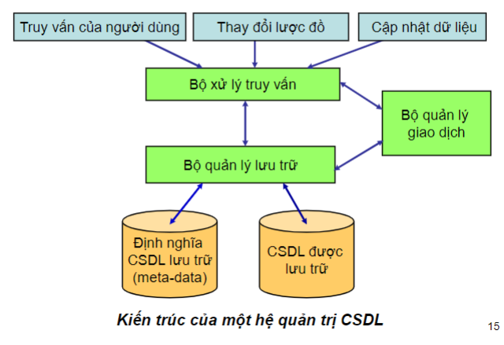

## Nhập môn cơ sở dữ liệu
1. **Cơ sở dữ liệu**
   - Khái niệm: tập hợp các dữ liệu theo một cấu trúc nhất định nhằm mục đích dễ dàng quản lý bao gồm đọc, thêm, sửa xóa dữ liệu.
       - Ví dụ: Danh sách học sinh của một trường.
   - Cấu trúc dữ liệu  tuân theo các quy tắc dựa trên lý thuyết toán học.
    - Cơ sở dữ liệu phản ánh trung thực thế giới dữ liệu hiện thực khách quan.
   - Đặc điểm cơ sở dữ liệu:
     - Cơ sở dữ liệu là tài nguyên thông tin dùng chung cho nhiều người.
     - Cơ sở dữ liệu được các hệ ứng dụng khai thác bằng ngôn ngữ con dữ liệu hoặc bằng các chương trình ứng dụng.
   - Đối tượng nghiên cứu của cơ sở dữ liệu.
     - Các thực thể và mối quan ffhệ giữa các thực thể.
2. **Hệ quản trị cơ sở dữ liệu.**
   - Khái niệm: Hệ quản trị cơ sở dữ liệu là hệ thống phần mềm điều khiển toàn bộ các chiến lược truy nhập và cấu trúc cơ sở dữ liệu.
   - Ví dụ: MySQL, PostgreSQL, Microsoft Access, SQL Server, FileMaker, Oracle, RDBMS, dataBASE, Clipper và FoxPro
   - Các chức năng của hệ quản trị cơ sở dữ liệu:
      - Mô tả dữ liệu tạo lập và duy trì sự tồn tại của CSDL.
      - Cho phép truy xuất vào CSDL theo thẩm quyền được cấp.
      - Cập nhật, chèn thêm, loại bỏ hay sửa đổi dữ liệu mức tệp.
      - Đảm bảo an toàn, bảo mật dữ liệu, tính toàn vẹn dữ liệu.
      - Tạo cấu trúc dữ liệu tương ứng với mô hình dữ liệu.
      - Đảm bảo tính độc lập dữ liệu.
      - Tạo mối liên kết giữa các thực thể.
      - Cung cấp phương tiện sao lưu, phục hồi.
      - Điều khiển chương trình.
   - Các thành phần của hệ quản trị cơ sở dữ liệu:
     - 
     - Cơ sở dữ liệu lưu trữ và metadata.
       - CSDL được lưu trữ tại thiết bị nhớ thứ cấp hoặc cấp 3.
       - Metadata (siêu dữ liệu) là dữ liệu về dữ liệu: mô tả các thành phần dữ liệu của CSDL.
     - Bộ quản lý lưu trữ: có trách nhiệm lưu trữ, truy xuất dữ liệu trên các thiết bị lưu trữ như đĩa, ổ cứng, bộ nhớ.
     - Bộ xử lý truy vấn: Biến đổi một câu truy vấn hoặc một thao tác CSDL, đang được biểu diễn tại một mức rất cao (ví dụ, ngôn ngữ SQL), thành một chuỗi các yêu cầu đối với dữ liệu được lưu trữ trong CSDL.
     - Bộ quản lý giao dịch: bao gồm quản lý lưu trữ và bộ xử lý truy vấn thực hiện các nhiệm vụ đảm bảo tính nhất quán, toàn vẹn, phục hồi của dữ liệu.
  
3. **Thao tác cơ bản.**
   - Thao tác với database:
       - Khởi tạo database:
         - Syntax: 
           ```Sql
           CREATE DATABASE <tên database>
           ```
         - Ví dụ:
           ``` Sql
           CREATE DATABASE Draft
           ```
       - Xóa database:
         - Syntax: 
           ``` Sql
           DROP DATABASE <tên database cần xóa>
           ```
         - Ví dụ:
           ``` Sql
           DROP DATABASE Draft
           ```
   - Thao tác với table:
     - Table gồm:
       - Record: bản ghi.
       - Column: trường thuộc tính.
     - Khởi tạo table:
       - Syntax:
          ``` Sql
            CREATE TABLE <Tên Table>
            (
              <Tên trường 1> <Kiểu dữ liệu>,

              <Tên trường 2> <Kiểu dữ liệu>,

              <Tên trường n> <Kiểu dữ liệu>
            )
          ```
        - Ví dụ:
          ``` Sql
          create table SINHVIEN
          (
            MASV NCHAR(10),
            HOTEN NVARCHAR(10),
            KHOA NVARCHAR(10)
          )
          ```
     - Xóa table:
       - Syntax:
         ```Sql
         DROP TABLE <tên table cần xóa>
         ```
       - Ví dụ:
         ```Sql
         DROP TABLE SINHVIEN
         ```
     - Một số lệnh khác:
       - Thêm/sửa thuộc tính:
         - Syntax:
           ```Sql
           ALTER <Tên table> ADD <Tên column> <Kiểu dữ liệu>
           ALTER COLUMN <Tên column> <Kiểu dữ liệu>
           ```
       - Xóa toàn bộ dữ liệu trong table:
         - Syntax:
           ```Sql
           TRUNCATE TABLE <tên table>
           ```
       - Ngăn cách các khối lệnh sử dụng lệnh `GO` 
  

