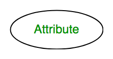
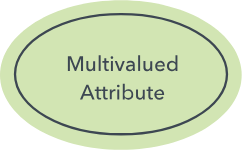
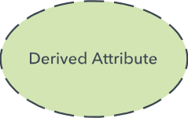
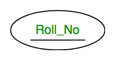
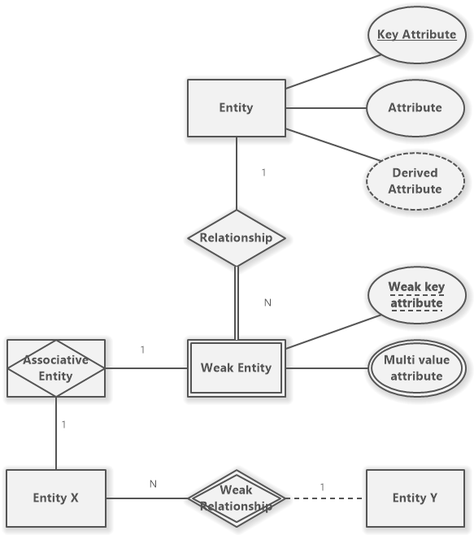
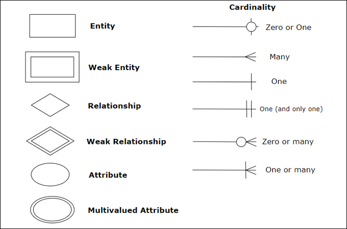
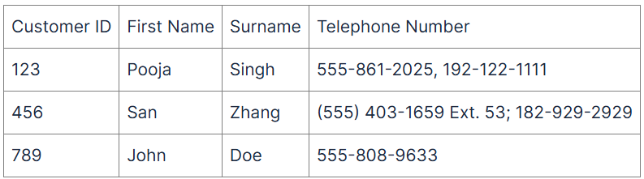
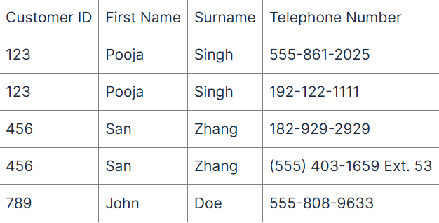
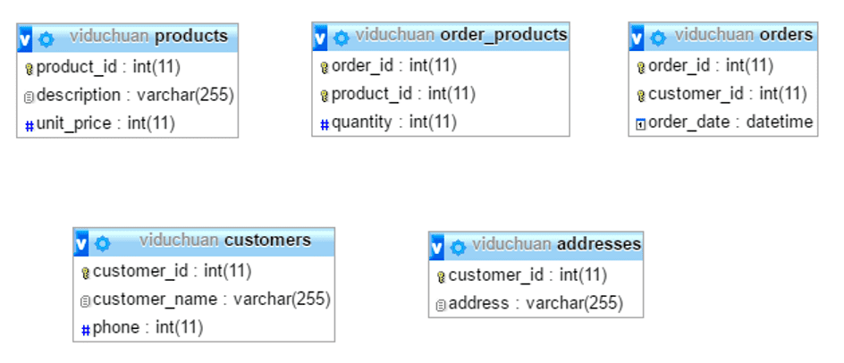
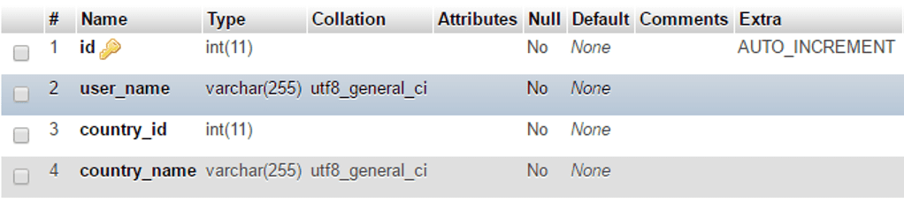

# Cơ bản về thiết kế cơ sở dữ liệu.
## Lý thuyết về thiết kế cơ sở dữ liệu.
1. **Tổng quan:**
    - Thiết kế cơ sở dữ liệu là quá trình chọn lọc, phân nhóm và tổ chức dữ liệu trên hệ thống. Công việc chính là chọn lọc dữ liệu nào sẽ được lưu trữ và quyết định tính tương quan giữa chúng. Nhờ database design, hệ thống sẽ dễ dàng đọc hiểu, quản lý, truy xuất thông tin thông suốt và tiết kiệm chi phí lưu trữ.
    - Một số khái niệm:
      - Mô hình dữ liệu:
        - là một hệ thống hình thức toán học gồm:
          - Hệ thống các ký hiệu biểu diễn dữ liệu.
          - Tập hợp các phép toán thao tác trên cơ sở dữ liệu.
        - Đặc trưng của mô hình dữ liệu.
          - Tính ổn định khi thiết kế mô hình dữ liệu.
          - Tính đơn giản, dễ hiểu, dễ thao tác.
          - Tính dư thừa cần phải kiểm tra kỹ lưỡng.
          - Tính đối xứng được bảo toàn.
          - Có cơ sở lý thuyết vững chắc.
        - Các loại mô hình dữ liệu.
          - Mô hình dữ liệu khái niệm.
            - Là một mô hình trừu tượng và tổng quan về dữ liệu trong một hệ thống thông tin. 
            - Tập trung vào việc mô tả các khái niệm, mối quan hệ và luồng thông tin chính trong một hệ thống, đồng thời chi tiết hóa về cách dữ liệu được lưu trữ hoặc triển khai.
          - Mô hình dữ liệu logic.
            -  Là một biểu đồ hoặc mô tả trừu tượng về cấu trúc dữ liệu và quan hệ giữa chúng mà không phụ thuộc vào hệ quản trị cơ sở dữ liệu (DBMS) cụ thể. 
            -  Mô hình này tập trung vào cách dữ liệu được tổ chức, mô tả các thực thể (entities), các thuộc tính (attributes) và mối quan hệ (relationships) giữa các thực thể đó.
          - Mô hình dữ liệu vật lý.
            - Là mô hình tập trung vào các khía cạnh về cấu trúc lưu trữ dữ liệu trong cơ sở dữ liệu.
            - Định nghĩa các đối tượng vật lý như bảng, cột, chỉ mục và quan hệ giữa chúng. Cung cấp chi tiết về cách dữ liệu được lưu trữ trên ổ đĩa hoặc hệ thống lưu trữ.
2. **Lợi ích khi có một cơ sở dữ liệu tốt.**
    - Tiết kiệm thời gian và nguồn lực khi cần tra cứu, trích xuất dữ liệu.
    - Hệ thống dễ bảo trì cập nhật.
    - Các bên liên quan có thể hiểu, vận dụng tốt dữ liệu.
3. **Nguyên tắc thiết kế cơ sở dữ liệu.**
    - Tránh trùng lặp dữ liệu.
    - Sử dụng các ràng buộc dữ liệu.
    - Thiết kế các bảng có kích thước hợp lý.
    - Sử dụng các khóa chính và khóa ngoại.
    - Thiết kế các bảng có cấu trúc đơn giản.
4. **Các bước thiết kế cơ sở dữ liệu:**
    - **Bước 1: Phân tích yêu cầu.**
        Cần phải xác định được:
      - Dữ liệu nào được lưu trữ trong CSDL.
      - Ứng dụng nào sẽ được xây dựng trên CSDL này.
      - Các thao tác nào được sử dụng thường xuyên và các yêu cầu về hiệu năng của hệ thống.
    - **Bước 2: Thiết kế cơ sở dữ liệu mức khái niệm.**
      - Những thông tin có được từ bước phân tích yêu cầu sẽ được dùng để phát triển mô tả mức tổng quát dữ liệu được lưu trong CSDL, cùng các ràng buộc cần thiết trên dữ liệu này.
    - **Bước 3: Mô hình dữ liệu logic.**
      - Một hệ quản trị CSDL sẽ được sử dụng để cài đặt CSDL và chuyển thiết kế CSDL mức khái niệm thành một lược đồ CSDL với mô hình dữ liệu của hệ quản trị CSDL đã chọn.
    - **Bước 4: Cải tiến lược đồ.**
      - Các lược đồ được phát triển ở mức 3 sẽ được phân tích các vấn đề tiềm ẩn. 
      - Tại đây, các cơ sở dữ liệu sẽ được chuẩn hóa, dựa trên lý thuyết toán học.
    - **Bước 5: Thiết kế CSDL mức vật lý.**
      - Mô phỏng khối lượng công việc và các phương pháp truy nhập để xác định các vấn đề tiềm ẩn trong CSDL. 
      - Quá trình này là nguyên nhân tạo ra các tệp chỉ mục, quan hệ nhóm. 
      - Trong trường hợp đặc biệt, toàn bộ mô hình khái niệm sẽ được xây dựng lại.
    - **Bước 6: Thiết kế an toàn báo mật.**
      - Xác định các nhóm người dùng và phân tích vai trò của họ để định nghĩa các phương pháp truy nhập dữ liệu.
5. **Một số khái niệm liên quan.**
    - Hàng, bản ghi, bộ dữ liệu, khóa, phụ thuộc hàm, lược đồ.
## Mô hình thực thể, quan hệ E-R.
  Mô hình thực thể liên kết gồm 3 khái niệm cơ bản: *tập thực thể*, *tập quan hệ* và *thuộc tính*.
1. **Thực thể**.
    - *Thực thể*:   
      - Là một đối tượng cụ thể trong thế giới thực và có thể phân biệt với các đối tượng khác.
        Ví dụ: con người, con cá, con mèo, ...
      - Phân loại thực thể:
        - Thực thể mạnh: tồn tại độc lập với thực thể khác.
            Ví dụ: thực thể nhân viên, công ty thì công ty là một thực thể mạnh.
            Kí hiệu trong ERD:
          
        - Thực thể yếu: không có thuộc tính khóa, sự tồn tại của nó phụ thuộc vào thực thể khác.
            Ví dụ: thực thể nhân viên, công ty thì nhân viên là một thực thể yếu.
            Kí hiệu trong ERD:
          
      - Thực thể được biểu diển bởi một tập các thuộc tính.
    - *Kiểu thực thể*: là một nhóm các thực thể có cùng thuộc tính như nhau được mô tả bằng tên và các thuộc tính. 
        Ví dụ: NHANVIEN (họ tên, tuổi, lương) là một kiểu thực thể.
    - *Tập thực thể* 
      - Là một tập hợp các thực thể của một kiểu thực thể trong cơ sở dữ liệu tại một thời điểm bất kỳ.
        Ví dụ: tập tất cả nhân viên trong một công ty.
      - Các tập thực thể không nhất thiết phải tách rời. 
      <!--  Không rõ tại sao -->
      - Mỗi thực thể trong tập có thể được mô tả bởi một tập các cặp <thuộc tính, giá trị>, ứng với từng thuộc tính trong tập thực thể.
      - Một CSDL gồm một tập các thực thể.
2. **Thuộc tính**.
    - Khái niệm:
      - Thuộc tính là các đặc trưng cụ thể mô tả cho một thực thể.
          Ví dụ: số học sinh trong một lớp, màu sơn của ô tô.
      - Mỗi thuộc tính có một tập giá trị cho phép, được gọi là miền (tập giá trị) của thuộc tính đó.
        - Một thuộc tính của một tập thực thể là một hàm ánh xạ từ một tập thực thể vào một miền giá trị.
        - Một tập thực thể có thể có nhiều thuộc tính.
      - Kí hiệu trong ERD:
          
    - Phân loại thuộc tính.
      - Theo khả năng phân chia:
        - Thuộc tính đơn là thuộc tính không thể phân chia ra thành các thành phần nhỏ hơn.
            Ví dụ: Thuộc tính tuổi của con người.
        - Thuộc tính kép là các thuộc tính có thể phân chia được thành các thành phần nhỏ hơn, biểu diễn các thuộc tính cơ bản hơn với ý nghĩa độc lập.
            Ví dụ: Nếu coi tên là một thuộc tính kép thì thuộc tính tên có thể phân chia thành họ, tên đệm và tên.
      - Theo giá trị.
        - Thuộc tính đơn trị có nhiều nhất một giá trị tại thời điểm cụ thể.
            Ví dụ: Thuộc tính CCCD của một người thì tại mọi thời điểm chỉ có duy nhất 1 số CCCD.
        - Thuộc tính đa trị có thể có nhiều giá trị tại thời điểm cụ thể.
            Ví dụ: Một người có thể sở hữu nhiều số điện thoại nên thuộc tính số điện thoại của một người có thể có nhiều giá trị.
            Kí hiệu trong ERD: 
            
      - Thuộc tính dẫn xuất: 
            Là thuộc tính mà giá trị của nó được dẫn xuất (tính toán) từ những giá trị của các thuộc tính hoặc thực thể có liên quan.
            Ví dụ: Một sinh viên có thuộc tính điểm của các môn học. Thuộc tính điểm trung bình chung có thể tính bằng cách tính trung bình điểm của các môn học.
            Kí hiệu trong ERD:
            
      - Thuộc tính rỗng: 
          Thuộc tính rỗng nhận giá trị rỗng khi thực thể không có giá trị cho nó.
      - Thuộc tính khóa:
          Là thuộc tính mà giá trị của nó là duy nhất cho mỗi thực thể, giúp phân biệt thực thể này và thực thể khác trong cùng một kiểu thực thể.
          Kí hiệu trong ERD:
          
    
3. **Quan hệ**
    - Khái niệm:
      - Quan hệ mô tả mối liên quan, liên hệ giữa các thực thể.
      - Mối liên hệ giữa các thực thể được gọi là sự tham gia, nghĩa là các thực thể E1, E2, .., En tham gia vào quan hệ R.
        Ví dụ: Bố, mẹ, ông, bà, con, cháu tham gia vào mối quan hệ cùng thuộc một gia đình.
      - Một thể hiện quan hệ trong lược đồ E-R biểu diễn mối liên hệ giữa các thực thể xác định trong thế giới thực đang được mô hình hóa.
      - Một mối quan hệ cũng có các thuộc tính gọi là các thuộc tính mô tả.
        Ví dụ: Một nhân viên thực hiện các công việc được giao, khoảng thời gian thực hiện được quy đinh -> khoảng thời gian là thuộc tính của mối quan hệ thực hiện.
    - Tập các quan hệ.
    - Bậc của các quan hệ là số lượng thực thể tham gia vào mối quan hệ.
        Ví dụ: 
    <!-- Số lượng thực thể ở đây là kiểu thực thể hay một thực thể cụ thể? -->
4. **Các ràng buộc trong mô hình E-R.**
    Các loại ràng buộc quan trọng: ánh xạ lực lượng liên kết, các ràng buộc tham gia, ràng buộc khóa.
    - Ánh xạ lực lượng liên kết:
      - Khái niệm: Ánh xạ lực lượng liên kết thể hiện số lượng các thực thể mà một thực thể khác có thể liên hệ thông qua một tập quan hệ. Ràng buộc này có ích nhất khi mô tả các quan hệ hai ngôi.
      - Một số loại ánh xạ lực lượng liên kết:
        - (1:1) một tới một từ A đến B.
            Ví dụ: Một sinh viên có thể đăng ký nhiều môn học. Tuy nhiên, mỗi khóa học chỉ chứa duy nhất một dòng dành cho học sinh đó.
          
        - (1:M) một tới nhiều từ A đến B.
        - (M:1) nhiều tới một từ A đến B.
            Ví dụ: Nhiều sinh viên thuộc cùng một lớp.
          
        - (M:M) nhiều tới nhiêu từ A đến B.
            Ví dụ: Sinh viên dưới dạng một nhóm có thể liên kết với nhiều giảng viên, giảng viên có thể liên kết với nhiều sinh viên.
          
    - Ràng buộc tham gia:
      - Các ràng buộc tham gia:
        - Sự tham gia của tập thực thể E trong tập quan hệ R được gọi là đầy đủ nếu mọi thực thể của E tham gia vào ít nhất một quan hệ trong R.
            Ví dụ: tất cả học sinh đều làm bài kiểm tra cuối kì.
        - Sự tham gia của tập thực thể E trong tập quan hệ R được gọi là một phần nếu chỉ có một vài thực thể của E tham gia vào một quan hệ trong R.
            Ví dụ: Chỉ có một số học sinh tham gia vào tiết mục văn nghệ của lớp.

    - Ràng buộc khóa.
      - Khóa của một tập thực thể:
        - Khóa (key) cho phép xác định một tập các thuộc tính để phân biệt các thực thể với nhau. 
        - Khóa cũng giúp xác định duy nhất các quan hệ để phân biệt các quan hệ với nhau.
      - Một số loại khóa:
        - Siêu khóa (superkey) là tập một hay nhiều thuộc tính để xác định một thực thể duy nhất trong tập thực thể.
            Ví dụ: Đối với sinh viên, siêu khóa có thể là (mã sinh viên).
        - Khóa dự bị (candidate key) là những siêu khóa mà không tập con nào của nó là siêu khóa.
            Ví dụ: một người có thể xác định bởi (họ tên, số sổ hộ khẩu gia đinh).
        - Người thiết kế sẽ chọn duy nhất một khóa dự bị để làm khóa chính (khóa của tập thực thể).
      - Ràng buộc khóa thỏa mãn hai thực thể khác nhau sẽ không có cùng giá trị trên tất cả thuộc tính khóa (khóa chính, khóa dự bị hay siêu khóa).
      
1. Lược đồ quan hệ E-R.
    - Tổng quan.
      - Sơ đồ E-R (Entity Relationship Diagram) là sơ đồ thể hiện mối quan hệ giữa các tập thực thể được lưu trữ trong cơ sở dữ liệu.
      - Sơ đồ E-R giải thích mối quan hệ logic giữa các tập thực thể trong cơ sở dữ liệu.
      - Sơ đồ E-R được tạo dựa trên ba thuộc tính cơ bản: thực thể, thuộc tính và mối quan hệ.
    - Hai loại sơ đồ E-R.
      - Quy ước kí hiệu theo Peter Chen.
      
      - Quy ước kí hiệu theo ký hiệu "chân chim". 
      
    - Xây dựng lược đồ quan hệ E-R.
      - Quy tắc: chính xác, tránh trùng lặp, dễ hiểu, chọn đúng mối quan hệ, chọn đúng kiểu thuộc tính.
      - Các bước:
        1. Liệt kê, chọn lọc thông tin.
        2. Xác định tập thực thể.
        3. Xác định mối quan hệ.
        4. Xác định thuộc tính và gán thuộc tính cho tập thực thể và mối quan hệ.
        5. Quyết định thuộc tính khóa.
        6. Vẽ biểu đồ mô hình thực thể E-R.
        7. Chuẩn hóa biểu đồ.
      - Ví dụ: Mô hình thực thể quan hệ về quản lý nhân sự và quản lý dự án.
        - Một phòng làm việc gồm nhiều nhóm làm việc và quản lý nhiều nhân viên.
        - Trong mỗi nhóm bao gồm nhiều nhân viên làm việc và có một người phụ trách.
        - Mỗi nhân viên thuộc một nhóm làm việc hoặc thuộc một phòng.
        - Nhân viên là một người phụ trách.
      
    

## Mô hình dữ liệu quan hệ.
1. Tổng quan.
    - Mô hình dữ liệu quan hệ là mô hình thể hiện mối quan hệ về mặt dữ liệu trong một đối tượng hoặc giữa các đối tượng với nhau.
    - Sử dụng các phép toán như hợp, giao, tích đề các, chia, trừ, chiếu, chọn, kết nối,..để xây dựng mô hình.
    - Mô hình dữ liệu quan hệ bao gồm một hoặc nhiều quan hệ (Relation).
    - Thực thể và thuộc tính trong mô hình ERD trở thành quan hệ và thuộc tính của quan hệ trong mô hình dữ liệu quan hệ. 
1. Các đặc trưng của mô hình dữ liệu quan hệ.
    - Mỗi quan hệ có một tên phân biệt với tên các quan hệ khác.
    - Các bộ là phân biệt và thứ tự của các bộ là không quan trọng.
    - Mỗi thuộc tính có một tên phân biệt, thứ tự của các thuộc tính là không quan trọng.
    - Quan hệ không có thuộc tính đa trị hay phức hợp.
2. Khái niệm khóa trong mô hình dữ liệu quan hệ.
    - Khóa chính:
      - Khóa chính là một hoặc một nhóm các thuộc tính trong một bảng dữ liệu, đại diện cho cách duy nhất để xác định mỗi bản ghi trong bảng đó (mỗi bảng chỉ có duy nhất một khóa chính).
      - Chức năng của khóa chính đảm bảo mỗi bản ghi là duy nhất.
    - Khóa ngoại:
      - Khóa ngoại là một hoặc một nhóm các thuộc tính trong một bảng dữ liệu, được sử dụng để liên kết với khóa chính của một bảng khác trong cơ sở dữ liệu.
      - Khóa ngoại giúp tạo mối quan hệ giữa 2 bảng. cho phép dữ liệu trong bảng hiện tại trỏ đến dữ liệu trong bảng khác.
      - So sánh khóa ngoại và khóa chính.
      
3. Các bước chuyển từ mô hình thực thể quan hệ sang mô hình quan hệ.
    - Bước 1: Chuyển tất cả tập thực thể sang mô hình quan hệ.
      - Thuộc tính thường phải bổ sung kiểu dữ liệu.
      - Chọn thuộc tính khóa.
      - Thuộc tính kết hợp phải chú thích phần kết hợp 
      <!-- không rõ là đúng hay sai -->
      - Thuộc tính đa trị thì lập một bảng riêng có khóa ngoại trỏ đến bảng chính.
    - Bước 2: Đối với mối quan hệ n-n.
      - Lập thêm một bảng riêng có tên mối quan hệ.
      - Bổ sung 2 khóa chính là khóa chính của 2 bảng.
    - Bước 3: Đối với mối quan hệ 1-n.
      - Thêm khóa ngoại từ bảng 1 vào bảng nhiều.
      - Trỏ khóa ngoại của bảng nhiều về bảng 1.
    - Bước 4: Đối với mối quan hệ 1-1.
      - Bổ sung khóa ngoại vào một hoặc cả 2 bảng.
      - Trỏ khóa ngoại của bảng này đến bảng kia.
    - Bước 5: Thực thể yếu chuyển thành một quan hệ.
      - Có cùng tên thực thể yếu.
      - Thêm thuộc tính khóa của quan hệ liên quan.
    - Bước 6: Thuộc tính đa trị.
      - Thêm quan hệ:
        - Có cùng tên với thuộc tính đa trị.
        - Thuộc tính khóa của quan hệ này là khóa ngoài của quan hệ chứa thuộc tính đa trị.
    - Bước 7: Liên kết 3 ngôi.
      - Lập một quan hệ:
        - Cùng tên với tên mối quan hệ đa ngôi.
        - Khóa chính là tổ hợp các khóa của tập các thực thể tham gia liên kết.
## Chuẩn hóa dữ liệu: 1NF, 2NF, 3NF
1. Tổng quan:
    - Chuẩn hóa dữ liệu đề cập đến quá trình tổ chức và cấu trúc dữ liệu theo cách loại bỏ sự trùng lặp, đảm bảo tính nhất quán và giảm thiểu các biến đổi dữ liệu.
    - Ba dạng chuẩn hóa đầu tiên: 1NF, 2NF, 3NF.
    <!-- - Một số khái niệm liên quan:
      - Quan hệ:
        - Định nghĩa: Cho tập $\Omega=\{{A_1, A_2, A_3, ..., A_n}\}$ là tập hữu hạn các thuộc tính. Mỗi thuộc tính có một miền giá trị $D(A_i)$ Khi đó, quan hệ $R(\Omega)$ trên $\Omega$ là tập các hàm:
          $$ R(\Omega) = \{{r|r: \Omega \rightarrow \cup D(A), A \epsilon \Omega}\}$$
          hoặc: 
          $$ R(\Omega) = \{(d_1, d_2,..., d_n)|d_i \epsilon \Omega, i=1 \div n \} $$
      - Phụ thuộc hàm:
        - Có 2 loại phụ thuộc hàm:
          - Ràng buộc giải tích.
          - Ràng buộc logic -->
2. Dạng chuẩn hóa 1NF.
    - Yêu cầu cầu mỗi cột trong bảng chỉ chứa các giá trị không thể phân tách và không có nhóm dữ liệu lặp lại.
    - Bảng lưu trữ tên và số điện thoại người dùng trước và sau khi chuẩn hóa.
    
    
3. Dạng chuẩn hóa 2NF.
    - Yêu cầu: dạng chuẩn hóa 2NF yêu cầu nó là dạng chuẩn 1NF và các thuộc tính không khóa phụ thuộc hàm đầy đủ vào khóa.
    - Dạng chuẩn hóa thứ hai được xây dựng trên cơ sở 1NF bằng việc loại bỏ các phụ thuộc một phần. Phụ thuộc một phần xảy ra khi một thuộc tính chỉ phụ thuộc một phần vào khóa chính.
    - Các bước:
      - Bước 1: Loại bỏ các thuộc tính không khóa phụ thuộc vào một bộ phận khóa chính và tách ra thành một bảng riêng, khóa chính của bảng là bộ phận của khóa mà chúng phụ thuộc vào.
      - Bước 2: Các thuộc tính còn lại lập thành một quan hệ, khóa chính của nó là khóa chính ban đầu.
    - Ví dụ:
    
      - Nhạn thấy hai thuộc tính unit_price, description trong bảng orders chỉ phụ thuộc vào khóa product_id chứ không phải khóa (product_id, customer_id, order_id) nên ta có thể tách bảng orders thành các bảng.
        - Products chứa thông tin product_id, description, unit_price.
        - Products_order chứa thông tin product_id, quantity, order_id.
        - Orders chứa thông tin order_id, customer_id, order_date.
    

4. Dạng chuẩn hóa 3NF.
    -Yêu cầu: phải là dạng chuẩn 2NF, mọi thuộc tính không khóa phụ thuộc bắc cầu vào thuộc tính khóa (tức là các thuộc tính không khóa phải được suy ra trực tiếp từ thuộc tính khóa).
    - Các bước:
      - Bước 1: Loại bỏ các thuộc tính phụ thuộc bắc cầu ra khỏi quan hệ và tách chúng thành quan hệ riêng có khóa chính là thuộc tính bắc cầu.
      - Bước 2: Các thuộc tính còn lại lập thành một quan hệ có khóa chính là khóa ban đầu.
    - Ví dụ:
      
      

